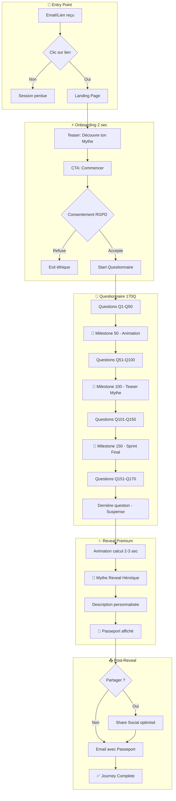
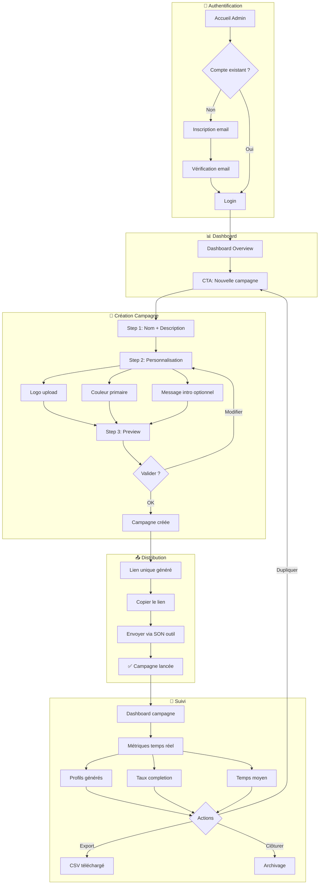
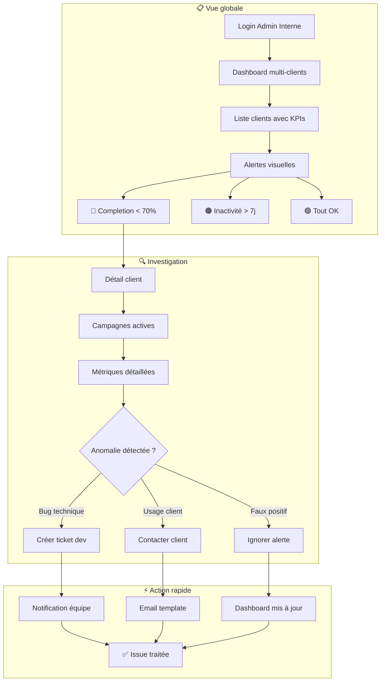

# UX Design Specification Ethnostyles Profiler

**Author:** Renaud.cosson-ext
**Date:** 2026-01-23

---

## Executive Summary

### Project Vision

Ethnostyles Profiler est une plateforme SaaS B2B d'assessment culturel basée sur un questionnaire de 170 questions. Le modèle Win-Win (répondant reçoit son profil, entreprise reçoit data) est le coeur de l'expérience UX et le différenciateur clé.

### Target Users

**Audience Primaire (Acheteurs B2B):**
- Marketing Directors cherchant à segmenter par valeurs
- DRH cherchant à objectiver le culture fit
- Data Leads cherchant à enrichir leur data lake
- Context: Desktop, sessions longues, focus analytique

**Audience Secondaire (Répondants):**
- Collaborateurs et clients finaux des entreprises clientes
- Context: Mobile (70%+), session unique, expérience émotionnelle
- Motivation: Découvrir leur profil culturel ("Mythe")

### Key Design Challenges

1. **Questionnaire Marathon** — 170 questions = risque d'abandon. UX doit maintenir l'engagement via progression, rythme, et anticipation du résultat.
2. **Dual-Device Experience** — Mobile-first pour répondants, Desktop-first pour admin. Deux expériences distinctes mais cohérentes.
3. **Moment Résultat** — Le profil "Mythe" est le payoff du Win-Win. Doit être mémorable, émotionnel, shareworthy.
4. **Performance Perçue** — < 2 sec entre questions, < 3 sec calcul profil. La fluidité est non-négociable.

### Design Opportunities

1. **Gamification Subtile** — Progression visuelle, milestones, variation du rythme pour maintenir l'engagement.
2. **Résultat Héroïque** — Présentation du "Mythe" comme une révélation personnelle, pas une simple liste de traits.
3. **Passeport Premium** — Design soigné du code personnel, encourageant fierté et partage.
4. **Admin Zero-Friction** — Dashboard minimaliste, time-to-first-campaign < 15 min.

## Core User Experience

### Defining Experience

L'expérience centrale d'Ethnostyles Profiler se divise en deux parcours distincts mais interconnectés :

**Parcours Répondant (Critique):**
Le répondant complète un questionnaire de 170 questions pour découvrir son profil culturel ("Mythe"). C'est l'expérience qui doit être parfaite — chaque seconde de friction = risque d'abandon.

**Parcours Admin B2B (Important):**
L'admin crée des campagnes, envoie des liens, et analyse les résultats. L'expérience doit être efficace mais peut être plus fonctionnelle.

### Platform Strategy

| Surface | Approche | Device |
|---------|----------|--------|
| Questionnaire | Mobile-first | Smartphone 70%+ |
| Résultat/Mythe | Mobile-first | Même session |
| Console Admin | Desktop-first | Laptop/Desktop |
| Dashboard | Responsive | Multi-device |

### Effortless Interactions

- **Transitions instantanées** — < 200ms entre questions, preload systématique
- **Progression omniprésente** — Barre visuelle + pourcentage + questions restantes
- **Sauvegarde invisible** — Auto-save chaque réponse, zéro perte
- **Reprise seamless** — URL ou Passeport permettent de reprendre exactement où on s'est arrêté
- **Calcul rapide** — Profil calculé en < 3 sec avec animation d'attente engageante

### Critical Success Moments

1. **First Question** — Comprendre le mécanisme en 2 secondes
2. **Mi-parcours (Q85)** — Célébrer le milestone, remotiver pour la suite
3. **Dernière Question** — Maximiser l'anticipation du résultat
4. **Reveal du Mythe** — Moment émotionnel fort, présentation héroïque
5. **Réception du Passeport** — Sentiment d'ownership personnel

### Experience Principles

1. **Flow > Features** — Chaque seconde compte. Jamais de friction inutile.
2. **Anticipation > Completion** — Le résultat est la récompense, pas l'obligation.
3. **Personal > Data** — Le répondant se sent valorisé, pas interrogé.
4. **Progress > Patience** — Toujours montrer l'avancement, jamais l'attente vide.

## Desired Emotional Response

### Primary Emotional Goals

**Répondant — Goal Principal:**
> "Je me reconnais dans ce profil, c'est vraiment moi."

L'expérience doit transformer 170 questions en voyage de découverte personnelle. Le répondant ne remplit pas un formulaire — il découvre qui il est.

**Admin B2B — Goal Principal:**
> "J'ai des insights actionnables sur mes clients/collaborateurs."

L'admin doit sentir qu'il a accès à une compréhension plus profonde que les data démographiques classiques.

### Emotional Journey Mapping

**Parcours Répondant:**
1. **Lien reçu** → Curiosité ("Découvre ton profil")
2. **Début (Q1-Q10)** → Engagement (rythme rapide, questions faciles)
3. **Corps (Q11-Q84)** → Flow (variations, micro-récompenses)
4. **Mi-parcours (Q85)** → Accomplissement (célébration 50%)
5. **Sprint final (Q86-Q169)** → Anticipation croissante
6. **Dernière question** → Excitation ("Ton profil est prêt !")
7. **Reveal du Mythe** → Surprise + Reconnaissance de soi
8. **Post-reveal** → Fierté + Envie de partager
9. **Passeport** → Ownership ("C'est MON code")

### Micro-Emotions

| À Cultiver | À Éviter |
|------------|----------|
| Confiance | Confusion |
| Curiosité | Ennui |
| Valorisation | Sentiment d'interrogatoire |
| Accomplissement | Fatigue |
| Reconnaissance de soi | Résultat générique |

### Design Implications

- **Curiosité** → Questions variées, formats différents, progression non-linéaire perçue
- **Engagement** → Gamification légère (pas enfantine), feedback immédiat
- **Anticipation** → Teaser du résultat visible, countdown questions restantes
- **Fierté** → Présentation "héroïque" du Mythe, pas un rapport clinique
- **Ownership** → Design premium du Passeport, format mémorable
- **Partage** → Visuel optimisé réseaux sociaux, citation personnalisée

### Emotional Design Principles

1. **Discovery > Survey** — Le répondant explore, il ne subit pas
2. **Personal > Generic** — Chaque résultat doit sembler unique et personnel
3. **Celebration > Completion** — Finir = gagner quelque chose, pas terminer une corvée
4. **Pride > Privacy** — Le profil est conçu pour être partagé avec fierté

## UX Pattern Analysis & Inspiration

### Inspiring Products Analysis

**Typeform** — Référence questionnaires engageants
- One question per screen, transitions fluides
- Progress bar élégante, keyboard navigation
- Application : Pattern de base pour les 170 questions

**Duolingo** — Gamification mature et respectueuse
- Milestone celebrations, micro-feedback constant
- Variation du rythme pour maintenir l'engagement
- Application : Célébrations à Q50, Q100, Q150

**Spotify Wrapped** — Révélation émotionnelle de données personnelles
- Storytelling progressif, design optimisé partage
- Data personnelle présentée comme "hero moment"
- Application : Reveal du Mythe en étapes, format shareable

**16Personalities** — Archétypes mémorables
- Profil avec personnalité forte, pas générique
- Noms évocateurs, descriptions assumées
- Application : "Mythes" distinctifs, pas des listes de traits

### Transferable UX Patterns

**Navigation:**
- One question per screen (Typeform)
- Swipe/keyboard pour répondre (Mobile-first)
- Progress bar toujours visible

**Engagement:**
- Milestone celebrations (Q50, Q100, Q150)
- Micro-animations à chaque réponse
- Variation du format/rythme des questions

**Reveal:**
- Storytelling progressif du profil
- Présentation "héroïque" du Mythe
- Design optimisé pour le partage social

### Anti-Patterns to Avoid

- **Multi-question pages** — Crée fatigue visuelle, réduit completion
- **Scroll infini** — Perte de repère, anxiety
- **Résultat générique** — Tue le Win-Win model
- **Partage obligatoire** — Non éthique, RGPD-unfriendly
- **Dark patterns** — Progress qui recule, surprises négatives

### Design Inspiration Strategy

**Adopt (Direct):** One question/screen, progress bar, milestone celebrations
**Adapt:** Spotify reveal → Mythe reveal, Duolingo streaks → session milestones
**Avoid:** Google Forms clinical feel, horoscope genericity, share walls

## Design System Foundation

### Design System Choice

**Choix : shadcn/ui + Tailwind CSS**

Stack moderne offrant le meilleur équilibre entre vitesse de développement, performance, et customisation pour Ethnostyles Profiler.

### Rationale for Selection

1. **Performance critique** — Tailwind génère du CSS minimal, optimisé pour le < 2 sec target
2. **Ownership total** — Composants copy-paste, pas de dépendance npm à maintenir
3. **Accessibilité native** — Basé sur Radix primitives, WCAG 2.1 AA by default
4. **Customisation illimitée** — Chaque composant modifiable pour matcher la brand Ethnostyles
5. **Animation ready** — Compatible Framer Motion pour les transitions questionnaire
6. **Standard industrie** — Documentation riche, patterns prouvés, communauté active

### Implementation Approach

| Surface | Approche |
|---------|----------|
| **Questionnaire** | Composants custom sur base shadcn/ui |
| **Console Admin** | Composants shadcn/ui avec theming |
| **Animations** | Framer Motion pour transitions |
| **Tokens** | Variables CSS Tailwind customisées |

### Customization Strategy

**Design Tokens à définir :**
- Palette couleurs Ethnostyles (primaire, accents, neutrals)
- Typographie (headings, body, captions)
- Spacing scale (8px base)
- Border radius (rounded-lg default)
- Shadows (elevation system)

**Composants custom prioritaires :**
- QuestionCard (une question = un écran)
- ProgressBar (gamified, milestone-aware)
- MythReveal (présentation héroïque du profil)
- PassportCard (design premium du code)

## Defining Experience

### The Core Interaction

**Ethnostyles Profiler Defining Experience:**
> "Découvre qui tu es vraiment en répondant à 170 questions, et reçois ton profil culturel unique — ton Mythe."

Cette interaction est le coeur du modèle Win-Win : l'utilisateur investit son temps (170 questions) en échange d'une récompense personnelle (son Mythe).

### User Mental Model

**Ce que l'utilisateur apporte :**
- Familiarité avec les quiz de personnalité
- Équation implicite : plus de questions = résultat précis
- Espoir : "Celui-ci va vraiment me comprendre"
- Peur : "Ça va être une perte de temps"

**Ce qu'on doit prouver :**
- Le temps investi en vaut la peine
- Le résultat est unique et personnel
- L'expérience n'est pas ennuyeuse

### Success Criteria

| Critère | Mesure |
|---------|--------|
| Flow | "Le temps est passé vite" |
| Recognition | "Je me reconnais dans le résultat" |
| Uniqueness | "C'est vraiment MOI" |
| Share-worthy | "J'ai envie de montrer mon Mythe" |
| Completion | Taux > 90% |

### Novel UX Patterns

**Patterns établis adoptés :**
- One question per screen (Typeform)
- Swipe/tap to answer (Mobile-native)
- Progress bar visible (Anxiety reduction)

**Innovations Ethnostyles :**
- Milestone celebrations gamifiées (Q50, Q100, Q150)
- Reveal storytelling du Mythe (inspiration Spotify Wrapped)
- Passeport personnel = code d'identité portable

### Experience Mechanics

**Flow en 9 étapes :**
1. **Initiation** — Clic lien → Landing teaser
2. **Onboarding** — Instructions 2 sec
3. **Questions** — Swipe/clic × 170
4. **Milestone 50%** — Célébration + teaser
5. **Sprint final** — Countdown anticipation
6. **Dernière Q** — Suspense
7. **Reveal Mythe** — Présentation héroïque
8. **Passeport** — Code personnel
9. **Share** — Optionnel, optimisé réseaux

## Visual Design Foundation

### Color System

| Role | Color | Hex | Usage |
|------|-------|-----|-------|
| Primary | Deep Indigo | #4F46E5 | Actions principales, brand |
| Secondary | Warm Gold | #F59E0B | Accents, milestones, célébrations |
| Success | Emerald | #10B981 | Completion, validation |
| Background | Off-white | #FAFAF9 | Fond questionnaire |
| Surface | White | #FFFFFF | Cards, modals |
| Text Primary | Slate 900 | #0F172A | Texte principal |
| Text Secondary | Slate 500 | #64748B | Texte secondaire |

**Semantic mapping :** Primary = introspection, Secondary = récompense, pas de rouge anxiogène.

### Typography System

| Level | Font | Size | Weight |
|-------|------|------|--------|
| H1 | Inter | 32px | Bold |
| H2 | Inter | 24px | Semibold |
| H3 | Inter | 20px | Medium |
| Body | Inter | 16px | Regular |
| Caption | Inter | 14px | Regular |
| Mythe Title | Playfair Display | 48px | Bold |

**Stratégie :** Inter pour UI (moderne, accessible), Playfair Display pour le moment Mythe reveal (impact émotionnel).

### Spacing & Layout Foundation

**Base unit :** 4px
**Scale :** 4, 8, 12, 16, 24, 32, 48px

**Layout par surface :**
- Questionnaire : Aéré, 100vh par question, focus maximal
- Admin : Dense, grid 12 colonnes, efficace
- Mobile : Touch targets 44px minimum

### Accessibility Considerations

- Contrast ratio : WCAG AA 4.5:1 minimum
- Touch targets : 44×44px minimum
- Focus visible : Ring indigo sur tous éléments interactifs
- Font size : 16px body minimum, jamais < 14px
- Motion : Respect prefers-reduced-motion

## Design Direction Decision

### Design Directions Explored

**Direction A: Minimal Focus** — Ultra-clean, Typeform-style, professional
**Direction B: Warm Engaging** — Gamified, friendly, high engagement
**Direction C: Premium Discovery** — Immersive, cinematic, memorable

### Chosen Direction

**Hybrid Approach:**
- Questionnaire : Direction B (Warm Engaging) — Maximise completion avec micro-interactions
- Mythe Reveal : Direction C (Premium Discovery) — Moment mémorable, share-worthy
- Console Admin : Direction A (Minimal Focus) — Efficace, professionnel, pas de distraction

### Design Rationale

1. **Questionnaire Warm** — 170 questions nécessitent engagement constant, pas juste efficacité
2. **Reveal Premium** — Le Mythe est le payoff du Win-Win, doit être mémorable
3. **Admin Minimal** — Les acheteurs B2B veulent efficacité, pas de "fun"

### Implementation Approach

| Surface | Direction | Key Elements |
|---------|-----------|--------------|
| Questionnaire | Warm Engaging | Progress gamifié, micro-animations, milestones |
| Mythe Reveal | Premium Discovery | Gradient backgrounds, cinematic transitions |
| Passeport | Premium Discovery | Design soigné, format mémorable |
| Console Admin | Minimal Focus | Clean tables, efficient forms, no clutter |
| Dashboard | Minimal Focus | Clear data viz, actionable metrics |

## User Journey Flows

### Flow 1 : Lucas (Répondant) — Du lien au Passeport

**Objectif :** Guider le répondant à travers 170 questions jusqu'à son profil avec un engagement maximal.

**Entry Points :**
- Email de campagne
- Lien direct partagé
- QR code (v1.5)



**Moments critiques et design :**

| Moment | Émotion cible | Design Response |
|--------|---------------|-----------------|
| Premier clic | Curiosité | Teaser visuel impactant |
| Q1 | Compréhension | Instruction 2 sec, geste évident |
| Q50 | Accomplissement | Animation célébration + % |
| Q100 | Anticipation | Teaser du Mythe ("Tu es proche...") |
| Q150 | Excitation | Countdown final visible |
| Q170 | Suspense | Pause dramatique |
| Reveal | Reconnaissance | Présentation héroïque, cinématique |
| Passeport | Fierté | Design premium, code mémorable |

**Error Recovery :**
- Auto-save chaque réponse
- URL de reprise envoyée par email si abandon > 5 min
- Passeport permet reprise à 0 question si déjà profilé

---

### Flow 2 : Marie (Admin B2B) — Création de campagne

**Objectif :** Time-to-first-campaign < 15 min avec zéro friction.

**Entry Points :**
- Inscription/Login
- Dashboard existant



**Wizard de création — 3 steps max :**

| Step | Champs | Optionnel |
|------|--------|:---------:|
| 1. Identité | Nom campagne, Description | ❌ |
| 2. Branding | Logo, Couleur primaire, Message intro | ✅ |
| 3. Preview | Aperçu répondant, Validation | ❌ |

**Feedback loop :**
- Preview live pendant la personnalisation
- Validation instantanée (pas de loading)
- Lien copiable en 1 clic

---

### Flow 3 : Claire (Account Manager) — Monitoring interne

**Objectif :** Voir d'un coup d'œil qui a des problèmes, agir en < 2 min.



**Alertes automatiques :**

| Alerte | Seuil | Action suggérée |
|--------|-------|-----------------|
| 🔴 Completion basse | < 70% | Vérifier bugs mobile |
| 🟠 Inactivité | > 7 jours | Relancer le client |
| 🔵 Volume inhabituel | > 2× moyenne | Féliciter / vérifier fraude |

---

### Journey Patterns

**Patterns de navigation identifiés :**

| Pattern | Usage | Implémentation |
|---------|-------|----------------|
| **One-tap progress** | Questionnaire | Swipe ou tap = réponse + transition |
| **Wizard linear** | Création campagne | Steps numérotés, back possible |
| **Dashboard drill-down** | Monitoring | Overview → Client → Campagne → Détail |

**Patterns de feedback :**

| Pattern | Usage | Implémentation |
|---------|-------|----------------|
| **Progress omnipresent** | Questionnaire | Barre + % + questions restantes |
| **Milestone celebration** | Q50, Q100, Q150 | Animation + message motivant |
| **Instant validation** | Admin forms | Check vert immédiat, pas de spinner |

**Patterns de récupération :**

| Pattern | Usage | Implémentation |
|---------|-------|----------------|
| **Auto-save invisible** | Questionnaire | Chaque réponse persistée |
| **Resume by URL** | Abandon | Même URL = reprise exacte |
| **Resume by Passeport** | Retour utilisateur | Code = profil complet (0 question) |

---

### Flow Optimization Principles

**Questionnaire (Lucas) :**
1. **Jamais plus de 2 sec entre questions** — Preload systématique
2. **Jamais d'écran de chargement visible** — Animation si calcul nécessaire
3. **Toujours montrer le progress** — Réduction anxiety
4. **Célébrer les milestones** — Maintenir l'engagement
5. **Reveal = moment hero** — Pas un simple affichage

**Admin (Marie) :**
1. **Time-to-first-campaign < 15 min** — 3 steps max
2. **Preview live** — Pas de surprise
3. **Copier le lien en 1 clic** — Friction minimale
4. **Dashboard = scannable** — KPIs en gros, détails au drill-down

**Monitoring (Claire) :**
1. **Alertes visuelles immédiates** — Voir les problèmes sans chercher
2. **Actions en < 2 clics** — Ticket ou email depuis l'alerte
3. **Historique conservé** — Traçabilité des interventions

## Component Strategy

### Design System Components (shadcn/ui)

**Composants utilisables directement :**

| Composant shadcn/ui | Usage Ethnostyles | Surface |
|---------------------|-------------------|---------|
| Button | CTAs, actions | Tout |
| Input | Forms admin | Admin |
| Card | Conteneurs génériques | Tout |
| Dialog | Modals consentement, confirmations | Tout |
| Table | Résultats campagnes, exports | Admin |
| Tabs | Navigation dashboard | Admin |
| Badge | Statuts, étiquettes | Admin |
| Progress | Base pour ProgressBar custom | Questionnaire |
| Toast | Notifications | Tout |
| Avatar | Utilisateurs, clients | Admin |
| DropdownMenu | Actions contextuelles | Admin |
| Sheet | Menus mobile | Mobile |

**Composants à themer :**
- Couleurs Ethnostyles (Indigo, Gold, Emerald)
- Border radius cohérent (rounded-lg)
- Shadows du design system

---

### Custom Components

#### QuestionCard

**Purpose :** Afficher une question du questionnaire en plein écran, optimisé mobile.

**Anatomy :**
```
┌─────────────────────────────────────┐
│  [ProgressBar]                      │
│                                     │
│         Question Text               │
│         (H2, centré)                │
│                                     │
│  ┌─────────────────────────────┐    │
│  │  Option A                   │    │
│  └─────────────────────────────┘    │
│  ┌─────────────────────────────┐    │
│  │  Option B                   │    │
│  └─────────────────────────────┘    │
│  ┌─────────────────────────────┐    │
│  │  Option C                   │    │
│  └─────────────────────────────┘    │
│                                     │
└─────────────────────────────────────┘
```

**States :**

| State | Description |
|-------|-------------|
| Default | Question affichée, options cliquables |
| Option Hover | Feedback visuel (border, background) |
| Option Selected | Animation de confirmation + transition |
| Loading | Preload question suivante (invisible) |

**Accessibility :**
- Tab navigation entre options
- Enter/Space pour sélectionner
- aria-label sur chaque option
- Focus visible ring

**Variants :**
- Mobile (swipe support)
- Desktop (keyboard navigation)

---

#### ProgressBar (Gamified)

**Purpose :** Montrer la progression avec milestones célébrés.

**Anatomy :**
```
┌─────────────────────────────────────┐
│  42%                      58 left   │
│  ═══════════●────────────────────   │
│           ▲50            ▲100       │
└─────────────────────────────────────┘
```

**Features :**
- Pourcentage visible
- Questions restantes
- Markers pour milestones (Q50, Q100, Q150)
- Animation fluide à chaque progression
- Couleur change à l'approche des milestones

**States :**

| State | Visual |
|-------|--------|
| Normal | Indigo fill |
| Approaching Milestone | Pulsing, Gold hints |
| At Milestone | Celebration animation |
| Sprint Final (>150) | Accelerated visual |

**Accessibility :**
- role="progressbar"
- aria-valuenow, aria-valuemin, aria-valuemax
- Screen reader annonce les milestones

---

#### MilestoneAnimation

**Purpose :** Célébrer les paliers Q50, Q100, Q150.

**Content par milestone :**

| Milestone | Message | Animation |
|-----------|---------|-----------|
| Q50 | "Déjà à mi-chemin !" | Confetti léger, Gold accent |
| Q100 | "Tu te rapproches de ton Mythe..." | Teaser visuel, suspense |
| Q150 | "Sprint final ! Plus que 20..." | Countdown accent, excitement |

**Timing :** 2-3 secondes max, non-bloquant si skip.

**Accessibility :**
- prefers-reduced-motion : version statique
- Screen reader : annonce vocale du milestone

---

#### MythReveal

**Purpose :** Présenter le profil Mythe de façon héroïque et mémorable.

**Anatomy :**
```
┌─────────────────────────────────────┐
│                                     │
│        [Gradient Background]        │
│                                     │
│           🏛️ MYTHE DU              │
│            PROGRÈS                  │
│         (Playfair 48px)             │
│                                     │
│     "L'innovateur optimiste"        │
│                                     │
│     ┌─────────────────────┐         │
│     │   Description du    │         │
│     │   profil...         │         │
│     └─────────────────────┘         │
│                                     │
│     [Voir mon Passeport]            │
│                                     │
└─────────────────────────────────────┘
```

**Animation Sequence :**
1. Fade in background gradient (0.5s)
2. Type effect sur "MYTHE DU..." (1s)
3. Reveal titre (0.5s)
4. Slide up description (0.5s)
5. CTA appear (0.3s)

**Variants :**
- Mobile : Portrait, scroll vertical
- Desktop : Centered, plus d'espace
- Share : Format optimisé réseaux sociaux (1200×630)

**Accessibility :**
- Pas d'auto-play audio
- prefers-reduced-motion : fade simple
- aria-live pour screen readers

---

#### PassportCard

**Purpose :** Afficher le code Passeport unique de façon premium et mémorable.

**Anatomy :**
```
┌─────────────────────────────────────┐
│  PASSEPORT ETHNOSTYLES              │
│  ━━━━━━━━━━━━━━━━━━━━━━━━━━━━━━━━   │
│                                     │
│         ETH-PRG-7X4K                │
│         (monospace, large)          │
│                                     │
│  "Ce code est ton identité          │
│   culturelle portable"              │
│                                     │
│  [📋 Copier]    [📤 Partager]       │
│                                     │
└─────────────────────────────────────┘
```

**Features :**
- Code en format mémorable (ETH-XXX-XXXX)
- Copy to clipboard en 1 tap
- Share natif (Web Share API)
- Design premium (border, shadow)

**States :**

| State | Visual |
|-------|--------|
| Default | Code visible, actions disponibles |
| Copied | Toast "Copié !", check animation |
| Sharing | Sheet native OS |

---

#### CampaignWizard

**Purpose :** Guider l'admin à travers la création de campagne en 3 steps.

**Anatomy :**
```
Step 1/3 ─────●─────○─────○

┌─────────────────────────────────────┐
│  Nom de la campagne                 │
│  ┌─────────────────────────────┐    │
│  │ Campagne clients Q1 2026    │    │
│  └─────────────────────────────┘    │
│                                     │
│  Description (optionnel)            │
│  ┌─────────────────────────────┐    │
│  │                             │    │
│  └─────────────────────────────┘    │
│                                     │
│            [Suivant →]              │
└─────────────────────────────────────┘
```

**Steps :**
1. **Identité** — Nom (requis), Description (optionnel)
2. **Branding** — Logo, Couleur, Message intro (tous optionnels)
3. **Preview** — Aperçu côté répondant, Validation

**Navigation :**
- Back possible à tout moment
- Progress indicator en haut
- Validation inline (pas de page d'erreur)

---

#### MetricCard

**Purpose :** Afficher un KPI de dashboard de façon scannable.

**Anatomy :**
```
┌─────────────────┐
│  Profils        │
│  1,247          │
│  ▲ +12% vs hier │
└─────────────────┘
```

**Variants :**
- Trend up (green)
- Trend down (red)
- Neutral (gray)
- Alert (orange border)

---

#### AlertCard

**Purpose :** Signaler une anomalie qui nécessite attention (monitoring interne).

**Anatomy :**
```
┌─────────────────────────────────────┐
│ 🔴 Client XYZ — Completion 62%      │
│    Dernière activité: il y a 3h     │
│    [Voir détails] [Contacter]       │
└─────────────────────────────────────┘
```

**Severity levels :**

| Level | Icon | Color | Trigger |
|-------|------|-------|---------|
| Critical | 🔴 | Red | Completion < 70% |
| Warning | 🟠 | Orange | Inactivité > 7j |
| Info | 🔵 | Blue | Volume inhabituel |

---

### Component Implementation Strategy

**Approche de développement :**

| Layer | Source | Exemple |
|-------|--------|---------|
| **Tokens** | Tailwind config | colors, spacing, fonts |
| **Primitives** | shadcn/ui | Button, Input, Card |
| **Composites** | Custom | QuestionCard, MetricCard |
| **Features** | Custom | MythReveal, CampaignWizard |

**Principes d'implémentation :**
1. **Composants custom = composition** — Utiliser les primitives shadcn/ui comme base
2. **Animations = Framer Motion** — Consistance et performance
3. **Responsive = Tailwind breakpoints** — sm, md, lg
4. **Accessibilité = Radix primitives** — Hérité de shadcn/ui

---

### Implementation Roadmap

**Phase 1 — MVP Core (Critique)**

| Composant | Criticité | Journey |
|-----------|:---------:|---------|
| QuestionCard | 🔴 | Lucas |
| ProgressBar | 🔴 | Lucas |
| MythReveal | 🔴 | Lucas |
| PassportCard | 🔴 | Lucas |
| CampaignWizard | 🔴 | Marie |

**Phase 2 — Admin Dashboard (Haute)**

| Composant | Criticité | Journey |
|-----------|:---------:|---------|
| MetricCard | 🟠 | Marie |
| DataTable (themed) | 🟠 | Marie |
| ChartWidget | 🟠 | Marie |

**Phase 3 — Monitoring & Polish (Moyenne)**

| Composant | Criticité | Journey |
|-----------|:---------:|---------|
| AlertCard | 🟡 | Claire |
| MilestoneAnimation | 🟡 | Lucas |
| StatusBadge | 🟡 | Claire |

**Dépendances techniques :**
```
shadcn/ui (base)
  └── Radix primitives
      └── Tailwind CSS
          └── Framer Motion (animations)
```

## UX Consistency Patterns

### Button Hierarchy

**Principes de hiérarchie :**

| Level | Usage | Style |
|-------|-------|-------|
| **Primary** | Action principale unique par écran | Filled, Indigo, bold |
| **Secondary** | Actions alternatives | Outlined, Indigo |
| **Ghost** | Actions tertiaires | Text only, hover underline |
| **Destructive** | Suppression, annulation | Filled, Red (avec confirmation) |

**Patterns par surface :**

| Surface | Primary | Secondary | Ghost |
|---------|---------|-----------|-------|
| Questionnaire | "Commencer", "Voir mon Mythe" | — | "Reprendre plus tard" |
| Admin Forms | "Créer", "Sauvegarder" | "Annuler" | "Supprimer" |
| Dashboard | "Nouvelle campagne" | "Exporter" | "Voir détails" |
| Modals | "Confirmer" | "Annuler" | — |

**Règles strictes :**
- **1 primary max par écran** — Éviter la paralysie de choix
- **Primary toujours visible** — Pas de scroll pour atteindre le CTA
- **Destructive = confirmation** — Toujours modal avant suppression
- **Touch target 44px** — Minimum sur mobile

---

### Feedback Patterns

#### Success Feedback

| Context | Pattern | Duration |
|---------|---------|----------|
| Réponse questionnaire | Micro-animation + transition | 200ms |
| Milestone atteint | Celebration overlay | 2-3 sec |
| Campagne créée | Toast + redirect | 3 sec |
| Export terminé | Toast + download auto | 3 sec |
| Copie clipboard | Toast "Copié !" | 2 sec |

**Design :**
- Couleur : Emerald (#10B981)
- Icon : Check animated
- Position : Top-right pour admin, center pour questionnaire

#### Error Feedback

| Context | Pattern | Recovery |
|---------|---------|----------|
| Validation form | Inline sous le champ | Fix + retry |
| API Error | Toast + retry button | Retry |
| Network offline | Banner persistent | Auto-reconnect |
| Session expirée | Modal + redirect login | Re-auth |

**Design :**
- Couleur : Red (#EF4444)
- Message : Clair + action possible
- Position : Inline pour forms, Toast pour API

**Règle critique :** Jamais d'erreur sans solution proposée.

#### Progress Feedback

| Context | Pattern |
|---------|---------|
| Questionnaire | ProgressBar gamifiée (toujours visible) |
| Upload fichier | Progress linear + % |
| Calcul profil | Animation engaging (2-3 sec) |
| Export long | Progress + "Vous pouvez fermer" |

**Règle :** Jamais d'attente > 500ms sans feedback visuel.

#### Milestone Feedback

| Milestone | Visual | Message | Durée |
|-----------|--------|---------|-------|
| Q50 | Confetti Gold | "Déjà à mi-chemin !" | 2 sec |
| Q100 | Teaser gradient | "Ton Mythe se dessine..." | 2.5 sec |
| Q150 | Countdown animation | "Sprint final !" | 2 sec |
| Q170 | Suspense transition | "Prépare-toi..." | 1.5 sec |

**Accessibility :** prefers-reduced-motion → version texte seule

---

### Form Patterns

#### Input Fields

| State | Visual |
|-------|--------|
| Default | Border gray, placeholder visible |
| Focus | Border Indigo, ring shadow |
| Filled | Border gray, value visible |
| Error | Border Red, message below |
| Disabled | Background gray-100, cursor not-allowed |

**Labels :** Toujours au-dessus, jamais placeholder-only.

#### Validation

| Type | Timing | Feedback |
|------|--------|----------|
| Required | On blur | "Ce champ est requis" |
| Format | On change (debounced) | "Format invalide" |
| API | On submit | Toast error |

**Pattern :** Validation inline, jamais de page d'erreur séparée.

#### Form Layout (Admin)

```
┌─────────────────────────────────────┐
│  Label                              │
│  ┌─────────────────────────────┐    │
│  │ Input                       │    │
│  └─────────────────────────────┘    │
│  Helper text ou error               │
│                                     │
│  Label                              │
│  ┌─────────────────────────────┐    │
│  │ Input                       │    │
│  └─────────────────────────────┘    │
│                                     │
│  [Secondary]     [Primary →]        │
└─────────────────────────────────────┘
```

**Règles :**
- Primary action à droite
- Cancel toujours disponible
- Save draft automatique si long form

---

### Navigation Patterns

#### Questionnaire Navigation

| Pattern | Implémentation |
|---------|----------------|
| Forward | Tap option → auto-advance |
| No back | Pas de retour en arrière (simplicité) |
| Exit | Ghost button → confirmation modal |
| Resume | URL conserve la position |

**Rationale :** Le questionnaire est un flow forward-only pour maximiser le momentum.

#### Admin Navigation

| Pattern | Implémentation |
|---------|----------------|
| Primary Nav | Sidebar fixe (Desktop), Hamburger (Mobile) |
| Breadcrumbs | Dashboard > Campagnes > [Nom] |
| Back | Browser back fonctionne |
| Deep links | Chaque écran a son URL |

**Structure :**
```
Sidebar
├── Dashboard
├── Campagnes
│   ├── Liste
│   └── Détail
├── Exports
└── Paramètres
```

#### Modal Patterns

| Type | Close | Backdrop |
|------|-------|----------|
| Informational | X + Escape + Click outside | Dimmed |
| Confirmation | Buttons only | Dimmed, no click |
| Destructive | Explicit "Annuler" | Dark, no click |

**Règle :** Modals toujours avec moyen de fermer évident.

---

### States Patterns

#### Loading States

| Context | Pattern | Timing |
|---------|---------|--------|
| Page load | Skeleton | Immédiat |
| Data fetch | Spinner inline | > 300ms |
| Action | Button disabled + spinner | Immédiat |
| Long process | Progress + cancel | > 3 sec |

**Règle :** Skeleton > Spinner quand layout connu.

#### Empty States

| Context | Message | Action |
|---------|---------|--------|
| No campaigns | "Créez votre première campagne" | [CTA Primary] |
| No results | "Aucun profil ne correspond" | [Modifier filtres] |
| No data | Illustration + message explicatif | [Action suggérée] |

**Design :**
- Illustration légère (pas clipart)
- Message empathique
- CTA vers l'action logique

#### Error States

| Type | Pattern | Recovery |
|------|---------|----------|
| 404 | Page dédiée | [Retour Dashboard] |
| 500 | Page dédiée | [Réessayer] + [Contacter support] |
| Offline | Banner top | Auto-reconnect |
| Permission | Message + redirect | [Retour] |

---

### Interaction Patterns

#### Hover & Focus

| Element | Hover | Focus |
|---------|-------|-------|
| Button Primary | Darken 10% | Ring Indigo |
| Button Secondary | Fill light | Ring Indigo |
| Card | Shadow increase | Ring Indigo |
| Link | Underline | Ring Indigo |
| Option (Questionnaire) | Background light + border | Ring visible |

**Règle :** Focus toujours visible pour keyboard navigation.

#### Transitions

| Type | Duration | Easing |
|------|----------|--------|
| Micro (hover, focus) | 150ms | ease-out |
| Small (buttons, toggles) | 200ms | ease-out |
| Medium (modals, cards) | 300ms | ease-in-out |
| Large (page, reveal) | 500ms | ease-in-out |

**prefers-reduced-motion :** Réduire à 0ms ou fade simple.

#### Touch Gestures (Mobile)

| Gesture | Action | Context |
|---------|--------|---------|
| Tap | Select | Questionnaire options |
| Swipe left | Next question | Questionnaire |
| Swipe down | Dismiss | Modals, sheets |
| Long press | — | Non utilisé |

---

### Consistency Rules Summary

| Règle | Application |
|-------|-------------|
| **1 primary action/screen** | Toutes surfaces |
| **Feedback < 500ms** | Toutes interactions |
| **Error = Solution** | Tous messages d'erreur |
| **Touch target 44px** | Mobile |
| **Focus visible** | Keyboard navigation |
| **Progress visible** | Attentes > 300ms |
| **prefers-reduced-motion** | Toutes animations |

## Responsive Design & Accessibility

### Responsive Strategy

#### Dual-Device Architecture

| Surface | Primary Device | Secondary | Strategy |
|---------|---------------|-----------|----------|
| **Questionnaire** | Mobile (70%+) | Tablet, Desktop | Mobile-first |
| **Mythe Reveal** | Mobile | All | Mobile-first |
| **Admin Console** | Desktop | Tablet | Desktop-first |
| **Dashboard** | Desktop | Mobile | Responsive |

#### Mobile Strategy (Questionnaire)

**Principes :**
- Full viewport height par question (100dvh)
- Touch-optimized : swipe, tap (pas de hover)
- Thumb zone priority : actions principales en bas
- Pas de scroll horizontal
- Font size minimum 16px (évite zoom iOS)

**Layout :**
```
┌─────────────────────┐
│ [Progress Bar]      │  ← Fixed top
│                     │
│                     │
│   Question Text     │  ← Centré verticalement
│                     │
│                     │
│ ┌─────────────────┐ │
│ │   Option A      │ │  ← Touch targets 48px
│ └─────────────────┘ │
│ ┌─────────────────┐ │
│ │   Option B      │ │
│ └─────────────────┘ │
│                     │
└─────────────────────┘
```

#### Desktop Strategy (Admin)

**Principes :**
- Sidebar navigation fixe
- Multi-column layouts (grid 12 cols)
- Information density optimisée
- Keyboard shortcuts disponibles
- Hover states pour feedback

**Layout :**
```
┌────────┬────────────────────────────────┐
│        │  Header / Breadcrumbs          │
│  Nav   ├────────────────────────────────┤
│  Bar   │                                │
│        │     Main Content Area          │
│  240px │     (responsive grid)          │
│        │                                │
│        │                                │
└────────┴────────────────────────────────┘
```

#### Tablet Strategy

**Questionnaire :** Même que mobile (portrait)
**Admin :** Sidebar collapsible, touch-friendly buttons

---

### Breakpoint Strategy

**Tailwind Breakpoints (standard) :**

| Breakpoint | Min-width | Usage |
|------------|-----------|-------|
| `sm` | 640px | Large phones landscape |
| `md` | 768px | Tablets |
| `lg` | 1024px | Desktop |
| `xl` | 1280px | Large desktop |
| `2xl` | 1536px | Ultra-wide |

**Application par surface :**

| Surface | Mobile | Tablet (md) | Desktop (lg+) |
|---------|--------|-------------|---------------|
| Questionnaire | Full viewport | Full viewport | Centré max-w-lg |
| Admin Nav | Hamburger | Collapsed | Full sidebar |
| Dashboard | Stack vertical | 2 colonnes | 3-4 colonnes |
| Tables | Cards empilées | Scroll horizontal | Full table |

**Mobile-first CSS :**
```css
/* Base = mobile */
.question-card { padding: 1rem; }

/* Tablet+ */
@media (min-width: 768px) {
  .question-card { padding: 2rem; }
}

/* Desktop+ */
@media (min-width: 1024px) {
  .question-card { max-width: 32rem; margin: auto; }
}
```

---

### Accessibility Strategy

#### WCAG 2.1 AA Compliance

**Niveau cible : AA** — Standard industrie, légalement sûr, bonne UX.

**Checklist WCAG 2.1 AA :**

| Critère | Exigence | Implémentation |
|---------|----------|----------------|
| **1.1.1** | Alt text images | Toutes images avec alt |
| **1.3.1** | Info & Relations | HTML sémantique |
| **1.4.3** | Contrast minimum | 4.5:1 texte, 3:1 UI |
| **1.4.4** | Resize text | Zoom 200% sans perte |
| **2.1.1** | Keyboard | Tout navigable au clavier |
| **2.1.2** | No keyboard trap | Focus jamais bloqué |
| **2.4.3** | Focus order | Tab order logique |
| **2.4.7** | Focus visible | Ring visible sur focus |
| **3.1.1** | Language | lang="fr" sur html |
| **4.1.2** | Name, Role, Value | ARIA correct |

#### Color Contrast

| Element | Foreground | Background | Ratio | Status |
|---------|------------|------------|:-----:|:------:|
| Body text | #0F172A | #FAFAF9 | 15.8:1 | ✅ AAA |
| Secondary text | #64748B | #FAFAF9 | 4.6:1 | ✅ AA |
| Primary button | #FFFFFF | #4F46E5 | 8.1:1 | ✅ AAA |
| Error text | #EF4444 | #FFFFFF | 4.5:1 | ✅ AA |

#### Keyboard Navigation

**Questionnaire :**

| Key | Action |
|-----|--------|
| Tab | Navigate between options |
| Enter/Space | Select option |
| Escape | Open exit confirmation |

**Admin :**

| Key | Action |
|-----|--------|
| Tab | Navigate fields/buttons |
| Enter | Submit form / Activate button |
| Escape | Close modal |
| Arrow keys | Navigate dropdowns, tables |

**Focus Management :**
- Focus visible avec ring Indigo 2px
- Skip link "Aller au contenu" en haut
- Focus trap dans les modals
- Focus restauré après fermeture modal

#### Screen Reader Support

**ARIA Patterns :**

| Component | ARIA |
|-----------|------|
| Progress | `role="progressbar"` + `aria-valuenow` |
| Modal | `role="dialog"` + `aria-modal="true"` |
| Alert | `role="alert"` + `aria-live="polite"` |
| Button | Bouton natif ou `role="button"` |
| Nav | `role="navigation"` + `aria-label` |

**Announcements :**
- Milestone atteint → annonce vocale
- Erreur form → annonce immédiate
- Chargement → `aria-busy="true"`

#### Motion & Animation

**prefers-reduced-motion :**
```css
@media (prefers-reduced-motion: reduce) {
  *, *::before, *::after {
    animation-duration: 0.01ms !important;
    transition-duration: 0.01ms !important;
  }
}
```

**Implémentation :**
- Milestone animations → fade simple
- Page transitions → cut direct
- Progress bar → pas d'animation
- Mythe reveal → fade sans typing effect

---

### Testing Strategy

#### Responsive Testing

**Devices réels prioritaires :**

| Device | OS | Priorité | Raison |
|--------|-----|:--------:|--------|
| iPhone 13/14 | iOS Safari | 🔴 | 40%+ du trafic mobile FR |
| Samsung Galaxy S21+ | Chrome Android | 🔴 | Android majoritaire |
| iPad Air | iPadOS Safari | 🟠 | Tablettes entreprise |
| MacBook Pro | Chrome/Safari | 🔴 | Admin users |
| Windows Laptop | Chrome/Edge | 🟠 | Admin users |

**Browser Matrix :**

| Browser | Desktop | Mobile | Support |
|---------|:-------:|:------:|---------|
| Chrome | ✅ | ✅ | Full |
| Safari | ✅ | ✅ | Full |
| Firefox | ✅ | ✅ | Full |
| Edge | ✅ | — | Full |
| Samsung Internet | — | ✅ | Full |

#### Accessibility Testing

**Outils automatisés :**
- axe DevTools (Chrome extension)
- Lighthouse Accessibility audit
- WAVE (WebAIM)

**Tests manuels obligatoires :**

| Test | Outil | Fréquence |
|------|-------|-----------|
| Keyboard navigation | Clavier seul | Chaque feature |
| Screen reader | VoiceOver (Mac/iOS), NVDA (Windows) | Chaque release |
| Zoom 200% | Browser zoom | Chaque page |
| Color contrast | Contrast checker | Design review |
| Reduced motion | OS setting | Chaque animation |

**Validation utilisateurs :**
- Tests avec utilisateurs réels (diversité capacités)
- Feedback loop avec associations handicap (si budget)

---

### Implementation Guidelines

#### Responsive Development

**Principes Tailwind :**
```jsx
// Mobile-first: base → sm → md → lg → xl
<div className="
  p-4          // mobile
  md:p-6       // tablet
  lg:p-8       // desktop
">

// Responsive grid
<div className="
  grid
  grid-cols-1  // mobile: stack
  md:grid-cols-2  // tablet: 2 cols
  lg:grid-cols-3  // desktop: 3 cols
  gap-4
">
```

**Images responsives :**
```jsx

```

**Touch targets :**
```jsx
// Minimum 44x44px
<button className="min-h-[44px] min-w-[44px] p-3">
  Action
</button>
```

#### Accessibility Development

**HTML sémantique :**
```jsx
<main>
  <article>
    <header>
      <h1>Titre</h1>
    </header>
    <section aria-labelledby="section-title">
      <h2 id="section-title">Section</h2>
      <p>Contenu...</p>
    </section>
  </article>
</main>
```

**Focus management :**
```jsx
// Modal focus trap (avec Radix/shadcn)
<Dialog>
  <DialogContent>
    {/* Focus automatiquement géré */}
  </DialogContent>
</Dialog>

// Focus après action
const buttonRef = useRef()
useEffect(() => {
  if (showSuccess) buttonRef.current?.focus()
}, [showSuccess])
```

**Skip link :**
```jsx
<a
  href="#main-content"
  className="sr-only focus:not-sr-only focus:absolute focus:top-4 focus:left-4"
>
  Aller au contenu principal
</a>
```

#### Performance Budget

| Metric | Target | Raison |
|--------|:------:|--------|
| LCP | < 2.5s | Core Web Vitals |
| FID | < 100ms | Interactivité |
| CLS | < 0.1 | Stabilité visuelle |
| Bundle JS | < 200KB gzip | Mobile 3G |
| First question render | < 2s | UX critique |

**Optimisations :**
- Code splitting par route
- Preload questions suivantes
- Images WebP avec fallback
- Font subsetting (Inter latin only)
